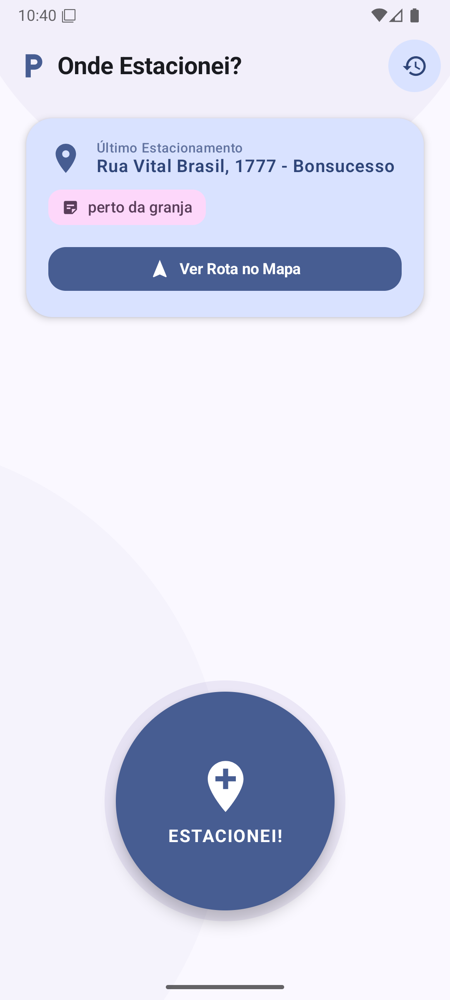
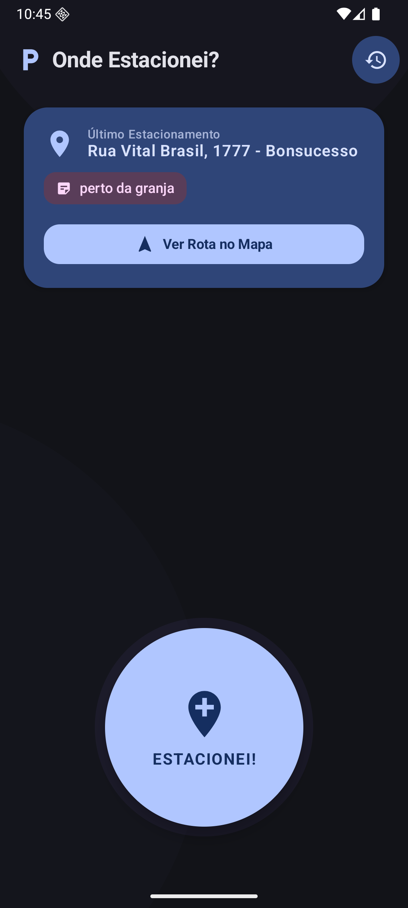
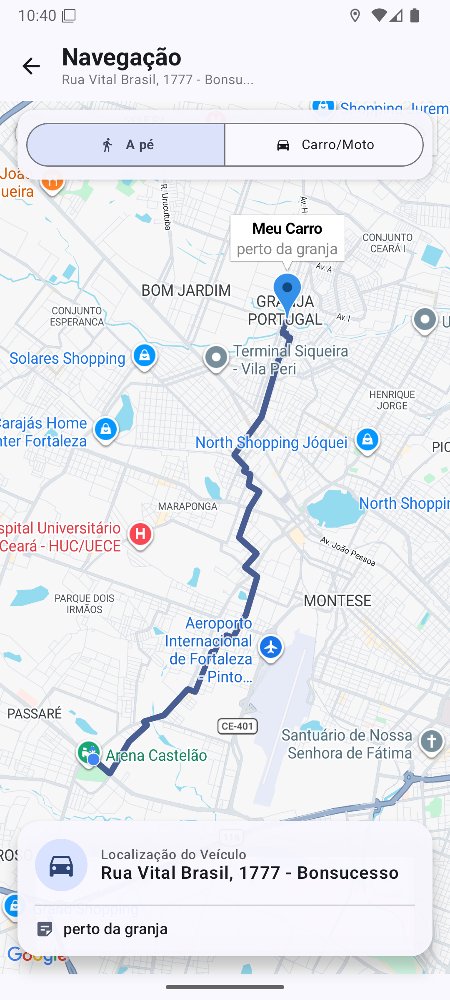
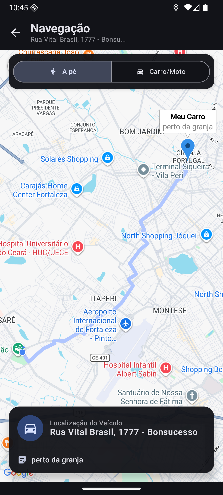
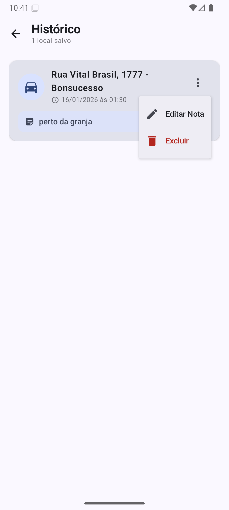
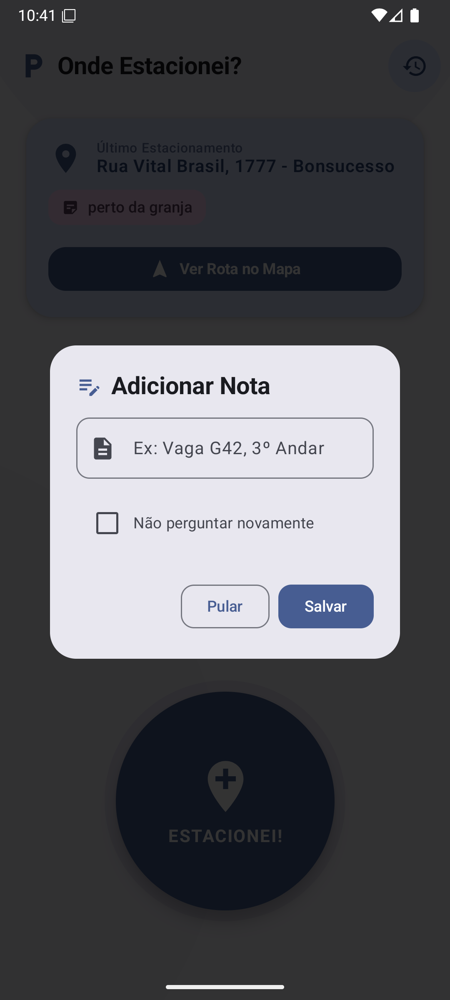

<p align="center">
  
</p>

<h1 align="center">Onde Estacionei?</h1>

<p align="center">
  Nunca mais perca seu carro. Salve, visualize e navegue até seu veículo com um único toque.
</p>

<p align="center">
  
  
  
  
  
  
  
  
  
  
  
  
</p>

---

## 📖 Sobre o Projeto

Quem nunca passou minutos preciosos procurando o carro em um estacionamento de shopping, em uma rua desconhecida ou no meio da multidão de um grande evento? Esse momento de incerteza pode ser frustrante e consumir um tempo valioso.

**Onde Estacionei?** é um assistente de estacionamento minimalista e confiável. Com apenas um toque, o usuário salva a localização exata do veículo. Ao retornar, o aplicativo exibe a posição do carro e a localização atual do usuário em um mapa interativo, traçando a melhor rota para o reencontro.

**Público-alvo:** motoristas que frequentam grandes centros urbanos, shoppings, aeroportos e eventos — onde encontrar o carro pode se tornar um desafio real.

---

## ✨ Funcionalidades

- [x] **Salvar localização com um toque** — Registra a posição GPS atual diretamente pela tela principal
- [x] **Mapa interativo** — Exibe a localização do carro e do usuário via Google Maps
- [x] **Navegação a pé / de carro** — Traça a rota em tempo real entre o usuário e o veículo
- [x] **Geocodificação reversa** — Converte coordenadas GPS em endereços legíveis
- [x] **Notas e detalhes** — Permite salvar informações extras como andar e número da vaga
- [x] **Histórico de locais** — Listagem e exclusão de registros salvos localmente
- [x] **Tema escuro / claro** — Interface adaptável com Material 3
- [x] **App Widget** — Salve sua localização diretamente pela tela inicial, sem abrir o app

---

## 🖼️ Screenshots

> As imagens abaixo ilustram as principais telas da aplicação.

| Tela Principal - Light Model | Tela Principal - Dark Model |
|:-:|:-:|
|  |  |

| Tela de Rota - Light Model | Tela de Rota - Dark Model |
|:-:|:-:|
|  |  |

| Tela de Histórico | Adicionar nota |
|:-:|:-:|
|  |  |
---

## 🏗️ Arquitetura

O projeto segue a arquitetura **MVVM (Model-View-ViewModel)** e é construído com o ecossistema moderno do Android.

| Camada | Tecnologia |
|---|---|
| **Linguagem** | Kotlin 2.0.21 |
| **UI** | Jetpack Compose + Material 3 |
| **Banco de dados** | Room |
| **Preferências** | DataStore |
| **Rede** | Retrofit + OkHttp |
| **Mapas** | Google Maps Compose |
| **Localização** | Play Services Location (Fused Location Provider) |
| **Rotas** | OpenRouteService API |
| **Permissões** | Accompanist Permissions |
| **Navegação** | Navigation Compose |
| **Background** | WorkManager |
| **Widget** | Glance |
| **Splash** | Core Splashscreen |

---

## 🚀 Como Executar

### Pré-requisitos

- Android Studio instalado
- Chaves de API do **Google Maps** e **OpenRouteService**

### 1. Clone o repositório
```bash
git clone git@github.com:profBruno-UFC-Qx/classroom-mobile-final-onde-estacionei.git
```

### 2. Acesse o diretório do projeto
```bash
cd classroom-mobile-final-onde-estacionei/ondeestacionei/
```

### 3. Abra no Android Studio
```bash
studio .
```

### 4. Configure as chaves de API

Por segurança, as chaves de API não estão incluídas no repositório — provedores como Google e OpenRouteService revogam chaves detectadas em repositórios públicos automaticamente.

Após obter suas chaves, localize o arquivo `local.properties` na raiz do projeto e adicione ao final:
```properties
MAPS_API_KEY=SUA_CHAVE_AQUI
ORS_API_KEY=SUA_CHAVE_AQUI
```

### 5. Execute o app

Conecte um dispositivo ou inicie um emulador e pressione **Run** no Android Studio.

---

## 📄 Licença

Este projeto foi desenvolvido para fins acadêmicos.
